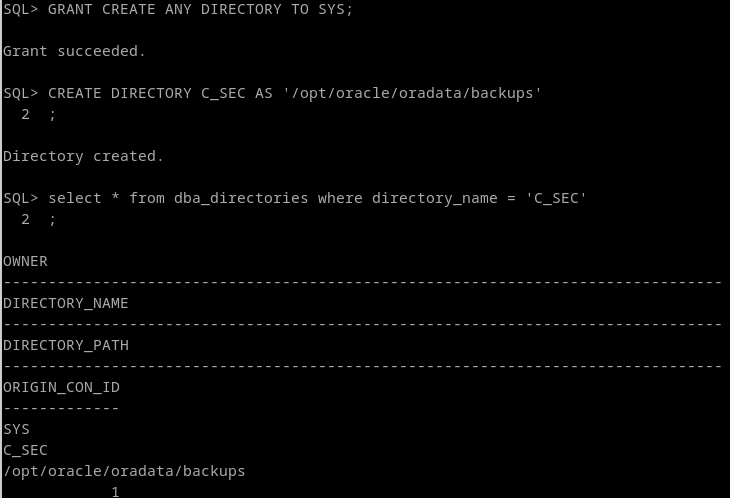
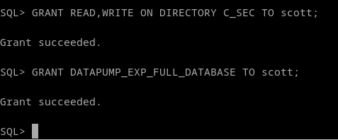
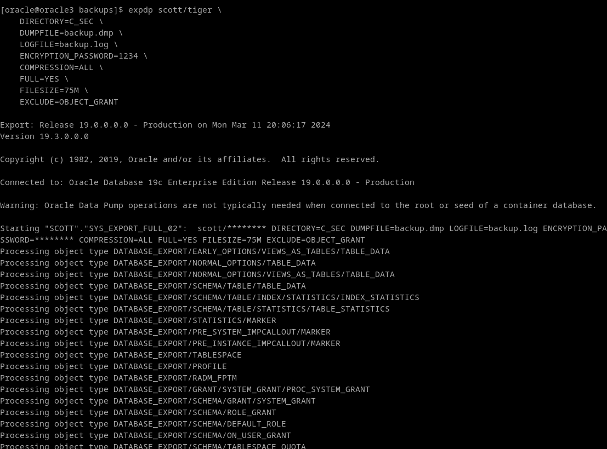
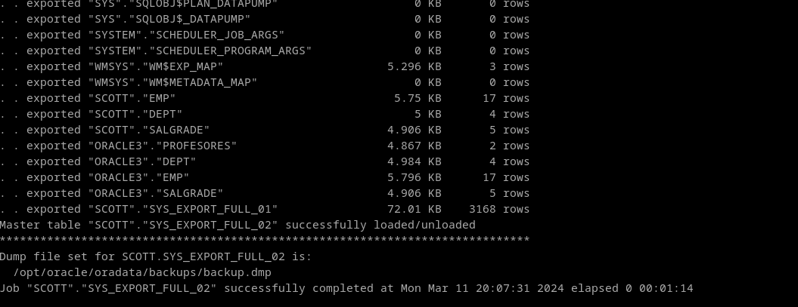
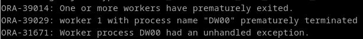

# 1. Realiza una copia de seguridad lógica de tu base de datos completa, teniendo en cuenta los siguientes requisitos:

### ▪ La copia debe estar encriptada y comprimida.
### ▪ Debe realizarse en un conjunto de ficheros con un tamaño máximo de 75 MB.
### ▪ Programa la operación para que se repita cada día a una hora determinada.


El primer paso será definir un directorio para las copias de seguridad:


Para decirle a oracle que ese directorio existe, hay que crear un objeto directorio

```
GRANT CREATE ANY DIRECTORY TO SYS;
CREATE DIRECTORY C_SEC AS '/opt/oracle/oradata/backups';
GRANT READ,WRITE ON DIRECTORY C_SEC TO scott;
GRANT DATAPUMP_EXP_FULL_DATABASE TO scott;
SELECT * FROM DBA_DIRECTORIES WHERE DIRECTORY_NAME='C_SEC';
```




Despues creamos la copia de seguridad de la base de datos con las especificaciones del enunciado:

**FULL=[ YES | NO ]**: realiza una copia de seguridad completa de la base de datos.

**FILESIZE=<num>[ B | KB | MB | GB | TB ]**: Tamaño de la division de los ficheros de la copia de seguridad.

**COMPRESSION=[ ALL | DATA_ONLY | METADATA_ONLY | NONE ]**: Elección de que se comprime.

**ENCRYPTION_PASSWORD**: Contraseña para encriptar de forma simétrica la copia de seguridad.

```
expdp scott/tiger \
    DIRECTORY=C_SEC \
    DUMPFILE=backup.dmp \
    LOGFILE=backup.log \
    ENCRYPTION_PASSWORD=1234 \
    COMPRESSION=ALL \
    FULL=YES \
    FILESIZE=75M \
    EXCLUDE=OBJECT_GRANT
```





**NOTA:** EXCLUDE=OBJECT_GRANT es la "solución" al error ORA-31671. Y digo solucion entre comillas por que es mas bien evitar el problema.
Por la poca información que he encontrado, se debe a que el script que se encarga de los objetos "object_grants" está mal optimizado, y mi máquina tiene poca memoria. Esto traerá consecuencias a la hora de importar de vuelta, ya que se perderán los permisos de los objetos borrados.

