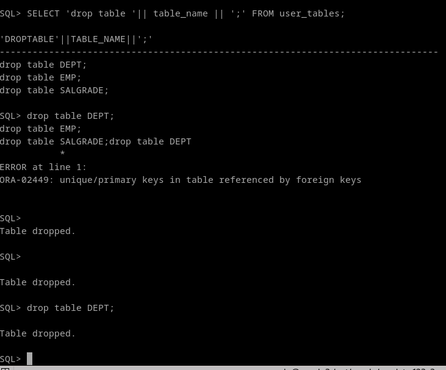
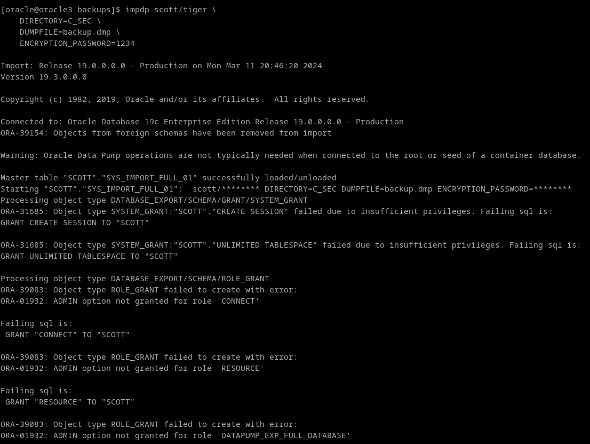
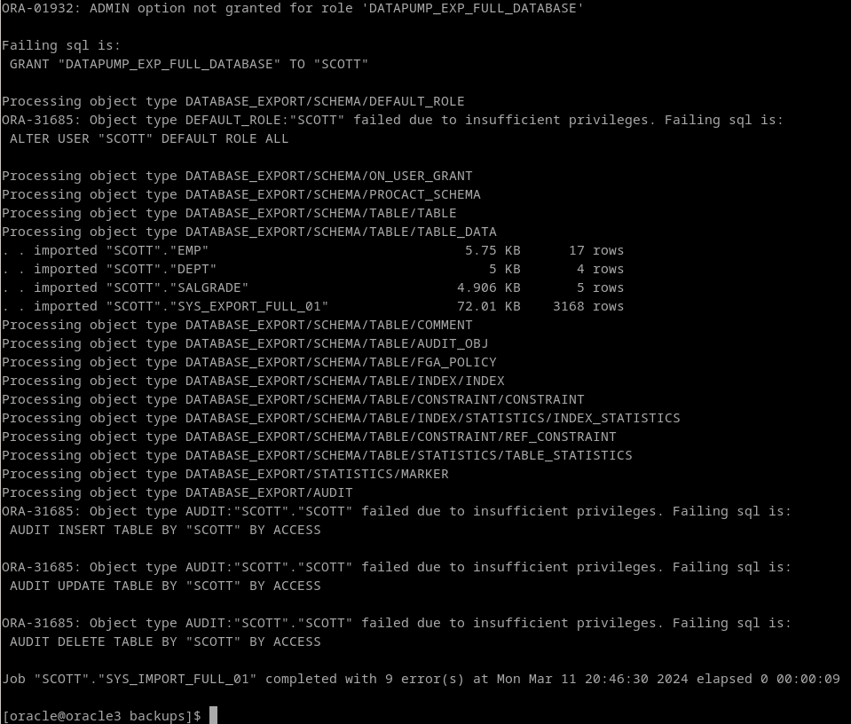
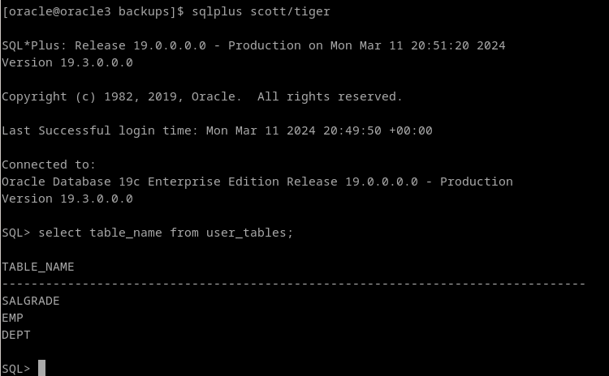

# 2. Restaura la copia de seguridad lógica creada en el punto anterior.

Oh no, alguien ha entrado en la cuenta de scott y le ha borrado las tablas con este script!
(se me ha olvidado el cascade)

```
SELECT 'drop table '|| table_name || ';' FROM user_tables;
```




Por suerte, tenemos una copia de seguridad de la base de datos:

```
impdp scott/tiger \
    DIRECTORY=C_SEC \
    DUMPFILE=backup.dmp \
    ENCRYPTION_PASSWORD=1234
```








Si tuvieramos varios archivos por que la bd fuera mas grande, utilizaríamos la opcion PARALLEL. Por ejemplo, vamos a imaginar que tenemos backup_01.dmp, y backup_02.dmp:

```
impdp scott/tiger \
    DIRECTORY=C_SEC \
    DUMPFILE=backup_%U.dmp \
    ENCRYPTION_PASSWORD=1234 \
    PARALLEL=3
```
