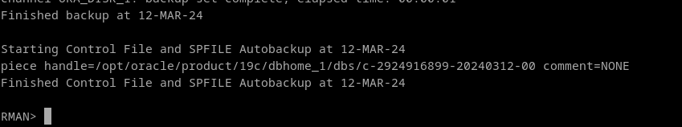

# 3. Pon tu base de datos en modo ArchiveLog y realiza con RMAN una copia de seguridad física en caliente.

El modo `ARCHIVELOG` de Oracle es un mecanismo de protección ante fallos del disco que permite realizar copias de seguridad en caliente. Para activar el modo archivelog reiniciamos la base de datos para montarla directamente en la instancia sin abrirla, si no no nos dejará:

```
shutdown immediate;
startup mount;
```

```
ALTER DATABASE ARCHIVELOG;
SELECT log_mode FROM V$DATABASE;
```


Podemos comprobar el estado con el siguiente comando:
```
ARCHIVE LOG LIST;
```


Ahora, podemos abrir de nuevo la base de datos.
```
ALTER DATABASE open;
```


Ahora que está el modo archivelog activo, vamos a utilizar la herramienta RMAN para hacer la copia de seguridad.

```
rman target sys
```


Podemos ver los parámetros por defecto para la copia de seguridad con `SHOW ALL`. Ya que no hemos tocado nada, estarán los parámetros por defecto.


Para hacer un paralelismo con el ejercicio 1, vamos a activar la encriptación y limitar el tamaño.

NOTA: MAXSETSIZE debe ser al menos tan grande como el datafile más grande. Porque un único datafile no se puede colocar en más de un fichero backups. Si limito el tamaño de un conjunto de respaldo a un valor menor que mi datafile más grande, no cabrá. Se pueden ver los tablespaces disponibles con `report schema;`
```
CONFIGURE ENCRYPTION FOR DATABASE ON;
CONFIGURE MAXSETSIZE TO 930 M;
```


Finalmente, podemos hacer la copia de seguridad con el siguiente comando:

```
BACKUP DATABASE;
```





El comando para listar los backup sets es `list backups`


