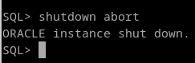
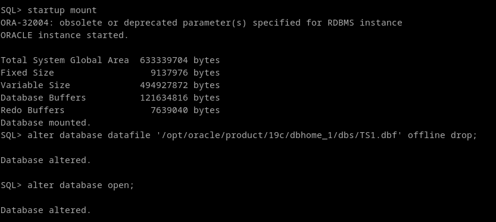
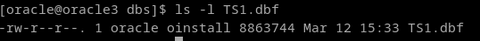

# 4. Borra un fichero de datos de un tablespace e intenta recuperar la instancia de la base de datos a partir de la copia de seguridad creada en el punto anterior.


lo borro de forma manual, sin borrar la definición, ya que si no sería tan simple como hacer un `ALTER DATABASE CLOSE;`, `RESTORE DATABASE;`


e intento recuperar el datafile
```
RESTORE DATABASE;

# o

RESTORE TABLESPACE TS1;
```


No se puede, por que a la hora de intentar recuperar el fichero, sale como que el tablespace está en uso, pero no se puede apagar la base de datos, y la recuperación no se puede hacer. Para ello hay que forzar, montarla en la instancia y decirle a la base de datos que no utilice el fichero.


```
shutdown abort;
startup mount;
alter database datafile '/opt/oracle/product/19c/dbhome_1/dbs/TS1.dbf' offline drop;
alter database open;
```





y volvemos a intentar recuperar el fichero, comprobamos que la recuperación es exitosa:


