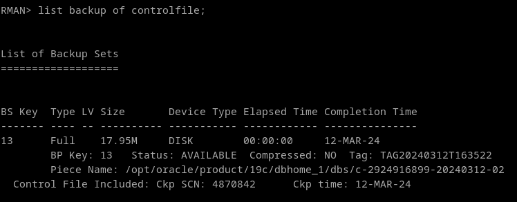

# 5. Borra un fichero de control e intenta recuperar la base de datos a partir de la copia de seguridad creada en el punto anterior.

**NOTA:** he hecho otro backup diferente, por eso cambia el nombre de los ficheros.


Para listar los ficheros de control utilizamos el siguiente comando: 
```
LIST BACKUP OF CONTROLFILE;
```


Ahora mismo lo detecta a pesar de no estar ahi. Esto se debe a que el archivo de control está guardado dentro de la base de datos, a parte de fuera, y rman lo que detecta es el contenido de dentro, por eso nos conectamos a la base de datos al iniciar la herramienta.

De hecho si que nos deja recuperar la base de datos. Eso si, es recomendable hacer otra copia de seguridad cuanto antes:

```
ALTER DATABASE CLOSE;
RESTORE DATABASE;
```


En caso contrario, si tenemos la copia de seguridad pero se ha borrado desde dentro de la base de datos, lo recuperariíamos con el siguiente comando:

```
RESTORE CONTROLFILE FROM '/opt/oracle/product/19c/dbhome_1/dbs/c-2924916899-20240312-02';
```
