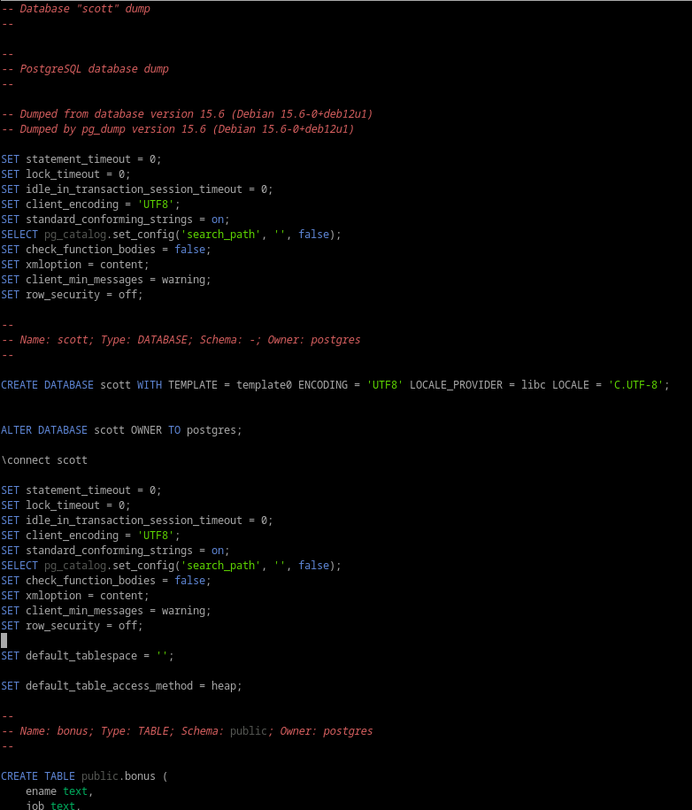

# 6. Documenta el empleo de las herramientas de copia de seguridad y restauración de Postgres.

**Creación del backup:**

En postgres, para hacer una copia de seguridad de toda la BD, utilizamos la herramienta **pg_dumpall**. Pero tiene bastantes limitaciones, como herramienta de gestion de copias de seguridad deja bastante que desear... Por ejemplo, basandonos en el ejercicio 1:

- No hay una forma nativa de [encriptar](https://www.imagescape.com/blog/encrypted-postgres-backups/) los archivos
- No hay opción nativa de comprimir, ya que lo que exportas es un script sql.
- No tiene opcion de tamaño máximo del fichero por lo mismo, aun que no la necesita por que los scripts no suelen ocupar mucho.

```
pg_dumpall -U postgres -f backup.sql
```


**Restauración:**

```
psql -U postgres -f backup.sql
```