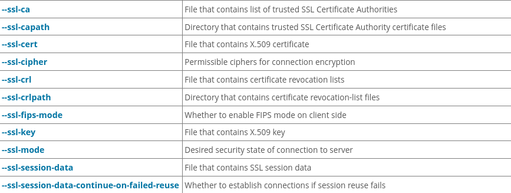
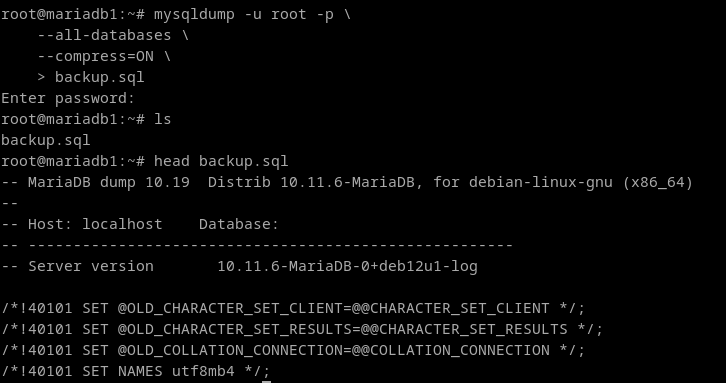

# 7. Documenta el empleo de las herramientas de copia de seguridad y restauración de MySQL.

**Creación del backup:**

De forma similar a postgres, las copias de seguridad en mariadb se hacen con scripts sql.

Intentando hacer el ejercicio 1:
- Encriptar: No tiene forma de encriptar el fichero de forma simetrica, pero si de forma asimetrica con las opciones `--ssl-*`. Aun que lo que hacen estas opciones se puede hacer de forma manual también:



- Comprimir: --compress[={OFF|ON}]
- Dividir: No se puede por la misma razon que en postgres.

```
mysqldump -u root -p \
    --all-databases \
    --compress=ON \
    > /backup.sql
```


**Restauración:**

```
mysql -u root -p < backup.sql
```