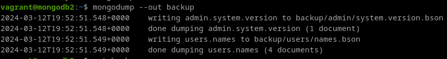

# 8. Documenta el empleo de las herramientas de copia de seguridad y restauración de MongoDB.

**Creación del backup:**

Para hacer un backup de toda la base de datos, solo hay que usar mongodump sin la opcion `--db`.

```
mongodump --out backup
```



**Restauración:**

Usamos la herramienta mongorestore.

```
mongorestore backups
```